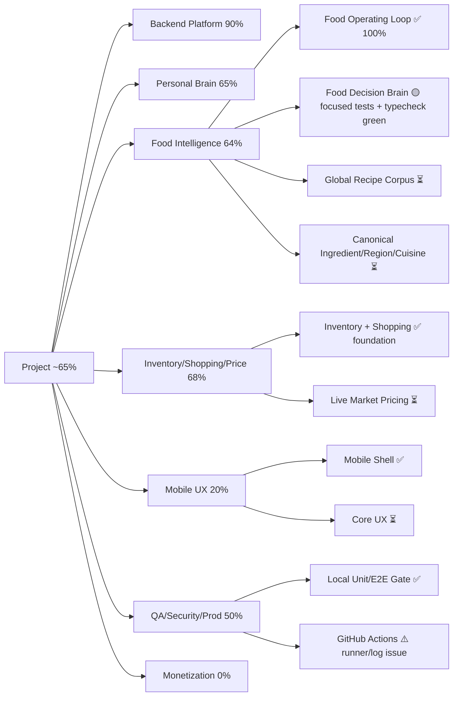

# Current State — My Personal Assistant

> Operational source of truth for progress, validated checkpoints, completed slices, unfinished work, and the test ledger.
>
> Latest fully validated locally before the current branch: 2026-08-18 11:26+03:30. The Food Operating Loop, Meal Planner and Recipe Scaling Metadata slice was fully green on the user's local runtime.

## Executive status

**Overall project completion: ~65%**

This is a weighted engineering/product-completion index, not a claim that 65% of every file is written. Backend foundations are strong, the 195-country food/currency layer is real, and the connected food loop now spans scaling, inventory, shopping handoff, recommendations and daily meal planning. Major unfinished product work remains in the verified global recipe corpus, live market pricing, mobile UX, production hardening, and monetization.

## Visual progress map



## Latest validated checkpoint — 2026-08-23

### Previously completed Quality Gate slice

```text
Backend unit:             153/153 suites, 410/410 tests — PASS
Backend lint:             0 errors — PASS
Backend build:            PASS
Backend E2E:              4/4 suites, 24/24 tests — PASS
Prisma validation:        PASS
Prisma migrations:        37/37 applied, schema up to date — PASS
Mobile typecheck:         PASS
Android export:           PASS
iOS export:               PASS
E2E teardown warning:     RESOLVED by Prisma disconnect hook
```

This slice is considered **100% complete for local validation**. GitHub Actions remains a separate infrastructure blocker because previous runs failed before useful job logs were available.

## Current change — Food Decision Brain

A deterministic food-decision layer is being added on top of the existing Food Operating Loop and Canonical Ingredient Intelligence rather than creating a parallel recipe-ranking system.

### Decision pipeline

```text
User food intent
  ↓
Personal context
  ↓
Hard dietary/allergy filters
  ↓
Serving-aware Food Operating Loop
  ↓
Inventory coverage / missing ingredients
  ↓
Nutrition fit
  ↓
Preference fit
  ↓
Novelty / recent-meal avoidance
  ↓
Country / cuisine context
  ↓
Recipe verification + missing-ingredient quality
  ↓
Weighted decision score
  ↓
Diversified ranking
  ↓
Reasons + score breakdown + rejected candidates
```

### Implemented

- `RecommendationEngineService` performs deterministic multi-signal food decisions.
- `PersonalizationService` builds food context from profile, assistant profile, nutrition profile, recent meals and user facts.
- `RecommendationRankingService` applies score ordering plus near-top recipe-family diversification.
- Food recommendation endpoint exists under `POST /recommendation-intelligence/food`.
- Recommendation Intelligence is wired into `AppModule`.
- Existing Recipe APIs and Food Operating Loop remain the canonical recipe/serving/inventory execution path.
- Canonical Ingredient Intelligence remains the upstream identity source; it is not duplicated by the recommendation engine.

### Important design boundaries

- Country is a relevance signal, not a cuisine restriction. A user in Iran asking for Indian food must still receive Indian options.
- Dietary/allergy hard blocks run before ranking. Uncertainty remains conservative.
- Missing ingredients are a ranking penalty by default; a caller can explicitly set a maximum missing-ingredient threshold when a strict pantry-only decision is required.
- Live price values are not fabricated. Budget-aware ranking should be added only after verified market-price coverage is available.
- Recommendation explanations are derived from actual scoring evidence, not invented after the decision.

### Validation ledger — DO NOT REPEAT THESE TESTS UNLESS CODE CHANGES AFFECT THEM

| Checkpoint | Result | Date | Notes |
|---|---|---|---|
| Backend Prisma Client generation | ✅ PASS | 2026-08-23 | Prisma Client v7.9.1 generated successfully |
| Backend typecheck | ✅ PASS | 2026-08-23 | `tsc -p tsconfig.json --noEmit` completed with no errors |
| Recommendation ranking unit tests | ✅ PASS | 2026-08-23 | Included in focused recommendation run |
| Personalization unit tests | ✅ PASS | 2026-08-23 | Included in focused recommendation run |
| Recommendation engine unit tests | ✅ PASS | 2026-08-23 | Included in focused recommendation run |
| Focused Recommendation test total | ✅ 3/3 suites, 4/4 tests | 2026-08-23 | Fully green |
| Backend lint for current branch | ⏳ NOT VALIDATED AFTER LAST CHANGES | 2026-08-23 | Must run after current branch stabilizes |
| Backend build for current branch | ⏳ NOT VALIDATED AFTER LAST CHANGES | 2026-08-23 | Must run after current branch stabilizes |
| Full backend Jest for current branch | ⏳ NOT VALIDATED AFTER LAST CHANGES | 2026-08-23 | Must run after current branch stabilizes |
| Recommendation API E2E | ⏳ NOT VALIDATED AFTER LAST CHANGES | 2026-08-23 | Must validate endpoint against real local PostgreSQL |
| Full backend E2E for current branch | ⏳ NOT VALIDATED AFTER LAST CHANGES | 2026-08-23 | Must run after recommendation API E2E |
| Mobile validation after current branch changes | ⏳ NOT APPLICABLE YET | 2026-08-23 | Recommendation slice is backend-only so far |

### Current slice status

**Food Decision Brain: ~45% of its own validation gate complete.**

Implementation is in place and the focused recommendation tests + backend typecheck are green. It is **NOT 100% yet** because full lint, build, full unit, recommendation API E2E and full backend E2E still need to pass on this branch.

### Next validation sequence

1. Backend lint.
2. Backend build.
3. Full backend Jest.
4. Recommendation API E2E against the isolated local PostgreSQL database.
5. Full backend E2E.
6. Re-run only changed/affected suites when fixing failures.
7. Mark the slice 100% only when all required checks are green.

## New Slice — Food Operating Loop + Meal Planning + Recipe Scaling Metadata

### Implemented on `main`

```text
Recipe + persisted ingredient scaling metadata
  ↓
Target servings
  ↓
Deterministic scaling engine
  ↓
Scaled ingredient quantities
  ↓
Inventory comparison using target quantities
  ↓
Unit normalization
  ↓
Missing ingredient calculation
  ↓
Shopping-ready handoff
  ↓
Country food context
  ↓
Local currency/finance context
  ↓
Deterministic meal recommendation
  ↓
Deterministic daily meal plan
```

### Validation state

**Implementation: complete for this current slice.**

**Local validation: 100% green.**

Focused result: **5/5 suites, 14/14 tests — PASS**.

## Global Food Intelligence — major slice on main

### Completed in main

- 195-country country-code coverage for the food routing layer.
- Country food profile for each market.
- Cuisine-family context.
- Staple-ingredient context.
- Signature/local recipe discovery anchors.
- Common cooking units.
- Hard-to-source ingredient metadata.
- Deterministic local recipe ranking.
- Explicit global-recipe behavior preserved.
- Cuisine-preserving substitution policy.
- Country-aware recipe API endpoints.
- Focused tests for exact 195-country coverage, Japan/Iran behavior, ranking and unknown-country handling.

### Still required for 100%

- Canonical ingredient taxonomy.
- Region/cuisine normalization beyond routing.
- Large verified recipe corpus with complete instructions and quantities.
- Nutrition provenance and quality controls.
- Allergens and dietary constraints coverage.
- Production-scale ingredient substitutions.
- Serving-scaling metadata for the entire catalog (architecture now ready; corpus population remains).
- Inventory matching across the full catalog.
- Shopping conversion across the full catalog.
- Provenance/versioning.
- Duplicate/alias/cultural-metadata QA.

## Global Currency / Finance Intelligence — major slice on main

### Completed in main

- 195-country local currency registry.
- Fraction-digit metadata.
- Country finance context.
- Source-native currency preservation policy.
- Comparison/normalization-only FX contract.
- Unknown-country rejection.
- Focused 195-country tests.

### Still required

- Full live-price coverage by country.
- Source verification per market.
- Full country-aware budget planning.
- Recipe → price → budget integration.

## Global Market / Price Intelligence — still separate

A larger stacked workstream exists in PR #48/#49 with 195-country market/source registry, routing, discovery-only fallbacks, cached FX, local-time scheduling, confidence scoring and price-source infrastructure.

It is **not on `main`** because the workstream is stacked and PR #48 currently has merge conflicts. It must be integrated deliberately after dependency/conflict review rather than force-merged.

## Mobile product — major work remains

Current main contains the Expo/mobile shell, local language state and assistant entry behavior.

Remaining:

- Complete auth UX.
- Onboarding.
- Home/dashboard.
- Nutrition logging UX.
- Recipe discovery/cooking UX.
- Serving selector and scaled ingredient UI.
- Food-plan/recommendation UI.
- Pantry/inventory UI.
- Shopping UI.
- Fitness/Yoga/Calisthenics/Gym UI.
- Habits/reminders/calendar/supplements UI.
- Brain chat/coach UX.
- Global settings UX.
- Offline/local-first behavior where appropriate.
- Accessibility/responsive behavior.
- Real-device iOS/Android validation.
- Store-release hardening.

## Production hardening — incomplete

Remaining:

- Full security audit.
- Authorization review across domains.
- Rate limiting/abuse controls.
- Production observability.
- Database performance/index review under realistic load.
- Background-job reliability.
- Notification delivery reliability.
- Backup/restore verification.
- Disaster recovery.
- Secret management review.
- Privacy/data-retention review.
- Migration-history review.
- Production deployment runbook.
- Cost controls and external-API fallback policy.
- Clean up any remaining non-fatal E2E worker warnings.

## Business / Monetization — not implemented

- Packaging.
- Free/paid boundaries.
- Billing/subscription.
- Pricing experiments.
- Store monetization.
- Growth/retention analytics.
- Referral/viral loops.
- Revenue dashboards.
- Legal/compliance/product policies.

## Progress index

| Workstream | Approx. completion |
|---|---:|
| Backend platform + architecture | 90% |
| Personal Brain / deterministic intelligence | 65% |
| Nutrition foundations | 74% |
| Fitness / Yoga / Calisthenics / Gym | 75% |
| Recipe & Food Intelligence | 68% |
| Inventory / Shopping / Price Intelligence | 68% |
| Mobile product / UX | 20% |
| AI orchestration / voice / globalization | 40% |
| QA / Security / Production hardening | 55% |
| Business / Monetization | 0% |

**Weighted overall index: ~65%.**

## Immediate next priorities

1. Finish Food Decision Brain validation and mark the slice 100%.
2. Add canonical ingredient/region/cuisine normalization.
3. Expand verified recipe corpus with provenance, allergens and dietary constraints.
4. Integrate the stacked Global Market workstream after conflict/dependency review.
5. Connect verified live price data into Food Operating Loop and budget recommendations.
6. Build the real mobile food journey around these APIs.
7. Add production hardening and observability.
8. Add monetization after the core user journey is genuinely strong.

## Working rule

A slice is 100% only when architecture, implementation, database changes, focused tests, integration/E2E tests, documentation, and required environment validation are all green. Do not weaken assertions to obtain green tests.
