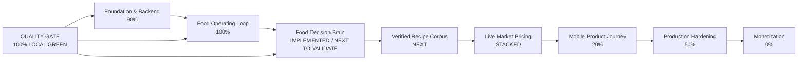

# Current State — My Personal Assistant

> Operational source of truth for progress, validated checkpoints, completed slices, unfinished work, and the test ledger.
>
> Latest fully validated local checkpoint: **2026-08-23 13:15+03:30**. The repository quality gate is green on the user's local runtime, including backend unit/E2E, typecheck, lint, build, Prisma migrations, and mobile Android/iOS validation.

## Progress map



### Current position at a glance

| Area | Status | What it means |
|---|---|---|
| Local quality gate | 🟢 **100%** | Unit + E2E + typecheck + lint + build + Prisma + Android/iOS export all green locally |
| GitHub Actions | 🟠 **Blocked externally** | Latest jobs fail before any step is recorded; GitHub log blob is unavailable |
| Food Operating Loop | 🟢 **100%** | Validated serving/scaling/inventory/shopping/meal-planning slice |
| Food Decision Brain | 🟡 **Next** | Implemented on `main`, now needs full local validation |
| Verified recipe corpus | 🟡 Planned | Provenance, allergens, dietary constraints, full quantities/instructions |
| Live market pricing | 🟠 Stacked | Infrastructure exists in separate stacked PRs; conflict/dependency review required |
| Mobile product | 🔵 20% | Core shell exists; real end-to-end user journey still needs major work |
| Production hardening | 🔵 50% | Security, observability, reliability, deployment and privacy remain |
| Monetization | ⚪ 0% | Not started |

## Executive status

**Overall project completion: ~65%**

This is a weighted engineering/product-completion index, not a claim that 65% of every file is written. Backend foundations are strong, the 195-country food/currency layer is real, and the connected food loop now spans scaling, inventory, shopping handoff, recommendations and daily meal planning. Major unfinished product work remains in the verified global recipe corpus, live market pricing, mobile UX, production hardening, and monetization.

## Latest fully green local checkpoint — 2026-08-23

```text
Backend unit tests:                 153/153 suites, 410/410 tests — PASS
Backend E2E:                          4/4 suites, 24/24 tests — PASS
Backend typecheck:                    PASS
Backend lint:                         0 errors — PASS
Backend build:                        PASS
Prisma validate:                     PASS
Prisma migrate deploy:               PASS (37 migrations)
Prisma migrate status:               Database schema is up to date
Mobile typecheck:                    PASS
Android JS export:                   PASS
iOS JS export:                       PASS

LOCAL QUALITY GATE:                  100% GREEN
```

The E2E suite now exits cleanly after closing the Prisma connection. There is no remaining Jest open-handle warning in the validated run.

## GitHub Actions validation state

GitHub Actions remains a separate infrastructure blocker and is **not** counted against local code/test completion:

- Latest Backend CI job: failed before any executable step was recorded.
- Latest Mobile CI job: failed before any executable step was recorded.
- GitHub job-log download returned `BlobNotFound` for both jobs.
- Because the user's GitHub Actions budget is exhausted, do not consume more minutes on blind reruns.

The repository is therefore considered **locally validated 100% for this slice**, while GitHub runner validation remains externally blocked.

## Current unvalidated change — Food Decision Brain

A deterministic food-decision layer is wired into the backend as the next intelligence slice. It is intentionally built on top of the existing Food Operating Loop and Canonical Ingredient Intelligence rather than creating a parallel recipe-ranking system.

### Decision pipeline

```text
User food intent
  ↓
Personal context
  ↓
Hard dietary/allergy filters
  ↓
Serving-aware Food Operating Loop
  ↓
Inventory coverage / missing ingredients
  ↓
Nutrition fit
  ↓
Preference fit
  ↓
Novelty / recent-meal avoidance
  ↓
Country / cuisine context
  ↓
Recipe verification + missing-ingredient quality
  ↓
Weighted decision score
  ↓
Diversified ranking
  ↓
Reasons + score breakdown + rejected candidates
```

### Implemented

- `RecommendationEngineService` performs deterministic multi-signal food decisions.
- `PersonalizationService` builds food context from profile, health, nutrition and recent meals.
- `RecommendationRankingService` applies score ordering plus near-top recipe-family diversification.
- Food recommendation endpoint exists under `POST /recommendation-intelligence/food`.
- Recommendation Intelligence is wired into `AppModule`.
- Existing Recipe APIs and Food Operating Loop remain the canonical recipe/serving/inventory execution path.
- Canonical Ingredient Intelligence remains the upstream identity source; it is not duplicated by the recommendation engine.

### Important design boundaries

- Country is a relevance signal, not a cuisine restriction. A user in Iran asking for Indian food must still receive Indian options.
- Dietary/allergy hard blocks run before ranking. Uncertainty remains conservative.
- Missing ingredients are a ranking penalty by default; a caller can explicitly set a maximum missing-ingredient threshold when a strict pantry-only decision is required.
- Live price values are not fabricated. Budget-aware ranking should be added only after verified market-price coverage is available.
- Recommendation explanations are derived from the actual scoring evidence, not invented after the decision.

### Current validation state

**Not yet fully validated locally.** This is the next slice to take to 100%.

Required checkpoint:

1. dependency/lockfile synchronization;
2. backend typecheck;
3. backend lint;
4. backend build;
5. full Jest;
6. recommendation-engine focused tests for hard filters, intent/cuisine matching, personalization, missing-ingredient threshold and diversification;
7. API integration/E2E for `POST /recommendation-intelligence/food`;
8. documentation + progress update only after all tests are green.

## New Slice — Food Operating Loop + Meal Planning + Recipe Scaling Metadata

### Implemented on `main`

```text
Recipe + persisted ingredient scaling metadata
  ↓
Target servings
  ↓
Deterministic scaling engine
  ↓
Scaled ingredient quantities
  ↓
Inventory comparison using target quantities
  ↓
Unit normalization
  ↓
Missing ingredient calculation
  ↓
Shopping-ready handoff
  ↓
Country food context
  ↓
Local currency/finance context
  ↓
Deterministic meal recommendation
  ↓
Deterministic daily meal plan
```

### Persisted RecipeIngredient scaling metadata

Each recipe ingredient now has:

- `measurementKind`
- `scalingPolicy`
- `scalingExponent`
- `batchSize`
- `maxLinearMultiplier`

The values can be supplied explicitly through the Recipe DTO. When omitted, the backend applies conservative deterministic inference rather than silently changing the user's recipe intent.

### New Food APIs

```text
GET  /recipes/recommendations?servings=2&countryCode=JP
GET  /recipes/meal-plan?servings=2&countryCode=JP
GET  /recipes/:id/food-plan?servings=50&countryCode=JP
POST /recipes/:id/food-plan/shopping?servings=50
```

### New Meal Plan API

```text
GET /budget-intelligence/meal-plan?servings=2&countryCode=JP
```

### Current guarantees

- Requested serving count is explicit and bounded to `1..10000`.
- Inventory is compared against **target-serving quantities**.
- Compatible mass units normalize across g/kg/mg/oz/lb.
- Compatible volume units normalize across ml/l.
- Count units normalize across piece/pcs/count.
- Unknown/incompatible units fail conservatively.
- Missing quantities are returned in the recipe's requested unit.
- Missing items can be handed directly to ShoppingService.
- Recommendations use inventory coverage, nutrition targets and country relevance deterministically.
- Daily meal planning uses nutrition targets and distinct recommendations where possible.
- Recipe scaling consumes persisted per-ingredient scaling policies instead of forcing every ingredient into linear scaling.
- No external Recipe API is required for these flows.
- Live price values are deliberately not fabricated because global verified price coverage is not complete.

### Validation state

**Implementation: complete for this current slice.**

**Local validation: 100% green.**

Focused tests:

- `food-operating-loop.service.spec.ts`
- `recipes.controller.spec.ts`
- `meal-planning.service.spec.ts`
- `budget-intelligence.controller.spec.ts`
- `recipes.service.scaling.spec.ts`

Focused result: **5/5 suites, 14/14 tests — PASS**.

## Global Food Intelligence — major slice on main

### Completed in main

- 195-country country-code coverage for the food routing layer.
- Country food profile for each market.
- Cuisine-family context.
- Staple-ingredient context.
- Signature/local recipe discovery anchors.
- Common cooking units.
- Hard-to-source ingredient metadata.
- Deterministic local recipe ranking.
- Explicit global-recipe behavior preserved.
- Cuisine-preserving substitution policy.
- Country-aware recipe API endpoints.
- Focused tests for exact 195-country coverage, Japan/Iran behavior, ranking and unknown-country handling.

### Still required for 100%

- Canonical ingredient taxonomy.
- Region/cuisine normalization beyond routing.
- Large verified recipe corpus with complete instructions and quantities.
- Nutrition provenance and quality controls.
- Allergens and dietary constraints coverage.
- Production-scale ingredient substitutions.
- Serving-scaling metadata for the entire catalog (architecture now ready; corpus population remains).
- Inventory matching across the full catalog.
- Shopping conversion across the full catalog.
- Provenance/versioning.
- Duplicate/alias/cultural-metadata QA.

## Global Currency / Finance Intelligence — major slice on main

### Completed in main

- 195-country local currency registry.
- Fraction-digit metadata.
- Country finance context.
- Source-native currency preservation policy.
- Comparison/normalization-only FX contract.
- Unknown-country rejection.
- Focused 195-country tests.

### Still required

- Full live-price coverage by country.
- Source verification per market.
- Full country-aware budget planning.
- Recipe → price → budget integration.

## Global Market / Price Intelligence — still separate

A larger stacked workstream exists in PR #48/#49 with 195-country market/source registry, routing, discovery-only fallbacks, cached FX, local-time scheduling, confidence scoring and price-source infrastructure.

It is **not on `main`** because the workstream is stacked and PR #48 currently has merge conflicts. It must be integrated deliberately after dependency/conflict review rather than force-merged.

## Mobile product — major work remains

Current main contains the Expo/mobile shell, local language state and assistant entry behavior.

Remaining:

- Complete auth UX.
- Onboarding.
- Home/dashboard.
- Nutrition logging UX.
- Recipe discovery/cooking UX.
- Serving selector and scaled ingredient UI.
- Food-plan/recommendation UI.
- Pantry/inventory UI.
- Shopping UI.
- Fitness/Yoga/Calisthenics/Gym UI.
- Habits/reminders/calendar/supplements UI.
- Brain chat/coach UX.
- Global settings UX.
- Offline/local-first behavior where appropriate.
- Accessibility/responsive behavior.
- Real-device iOS/Android validation.
- Store-release hardening.

## Production hardening — incomplete

Remaining:

- Full security audit.
- Authorization review across domains.
- Rate limiting/abuse controls.
- Production observability.
- Database performance/index review under realistic load.
- Background-job reliability.
- Notification delivery reliability.
- Backup/restore verification.
- Disaster recovery.
- Secret management review.
- Privacy/data-retention review.
- Migration-history review.
- Production deployment runbook.
- Cost controls and external-API fallback policy.

## Business / Monetization — not implemented

- Packaging.
- Free/paid boundaries.
- Billing/subscription.
- Pricing experiments.
- Store monetization.
- Growth/retention analytics.
- Referral/viral loops.
- Revenue dashboards.
- Legal/compliance/product policies.

## Progress index

| Workstream | Approx. completion |
|---|---:|
| Backend platform + architecture | 90% |
| Personal Brain / deterministic intelligence | 65% |
| Nutrition foundations | 74% |
| Fitness / Yoga / Calisthenics / Gym | 75% |
| Recipe & Food Intelligence | 66% |
| Inventory / Shopping / Price Intelligence | 68% |
| Mobile product / UX | 20% |
| AI orchestration / voice / globalization | 40% |
| QA / Security / Production hardening | 55% |
| Business / Monetization | 0% |

**Weighted overall index: ~66%.**

> The index is intentionally approximate. The stronger signal is the per-workstream status and the explicit 100% validation checkpoints above.

## Immediate next priorities

1. **Validate Food Decision Brain to 100%** — this is the selected next slice.
2. Canonical ingredient/region/cuisine normalization and merge-review of the existing stacked work.
3. Expand verified recipe corpus with provenance, allergens and dietary constraints.
4. Integrate the stacked Global Market workstream after conflict/dependency review.
5. Connect verified live price data into Food Operating Loop and budget recommendations.
6. Build the real mobile food journey around these APIs.
7. Add production hardening and observability.
8. Add monetization after the core user journey is genuinely strong.

## Working rule

A slice is 100% only when architecture, implementation, database changes, focused tests, integration/E2E tests, documentation, and required environment validation are all green. Do not weaken assertions to obtain green tests.

## Latest completed checkpoint

**2026-08-23 — Quality Gate / Local Full Validation: 100% ✅**

This checkpoint is complete and should not be repeated unless the underlying branch changes.
